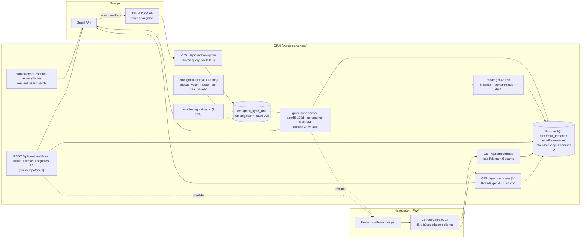
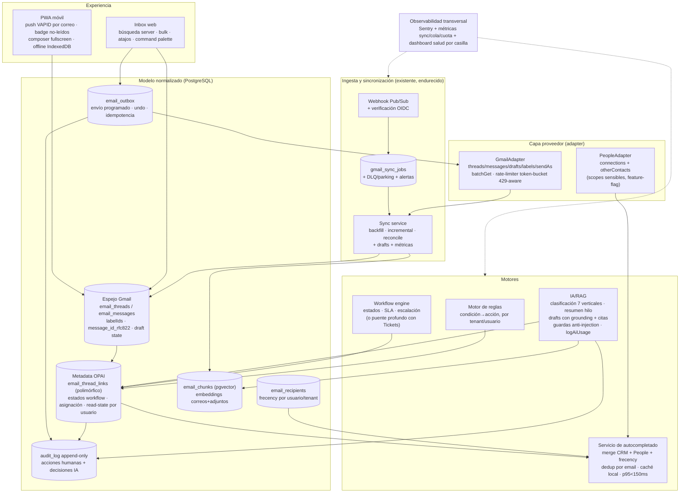

# Auditoría del módulo de correo OPAI — Gap Analysis (Fase 1)

- **Fecha:** 2026-07-22
- **Alcance:** `src/modules/crm/email/` (52 archivos), `src/app/api/crm/{gmail,correos,emails,email-templates}/`, `src/app/api/webhook/gmail/`, crons de correo (`flush-gmail-sync`, `gmail-sync-all`, `calendar-channel-renew`, `cleanup-gmail-attachments`, `radar-*`, `followup-emails`), UI `src/components/crm/correos/` (38 archivos), esquema Prisma (`crm.email_*`), y módulos adyacentes (Tickets, Agenda, Knowledge/RAG, PWA).
- **Método:** revisión estática de código con verificación end-to-end de cada flujo (no se asumió funcionalidad por existencia de UI/tabla). No se ejecutó contra producción ni se modificaron datos. Cada afirmación cita archivo, símbolo y líneas aproximadas.
- **Escala de madurez:** 0 ausente · 1 prototipo/solo UI · 2 parcial/frágil · 3 funcional e2e sin pruebas/seguridad/observabilidad suficientes · 4 calidad de producción.

---

## 1. Resumen ejecutivo

### Madurez actual

El módulo de correo de OPAI es hoy una **bandeja personal de triage comercial sobre Gmail**, no un cliente de correo completo ni una bandeja colaborativa. El puntaje ponderado global es **≈ 44 %** (ver §4), con una distribución muy desigual:

| Categoría | Puntaje ponderado |
|---|---|
| A. Núcleo Gmail | ≈ 52 % |
| B. Productividad personal | ≈ 44 % |
| C. Colaboración | ≈ 8 % |
| D. Inteligencia artificial | ≈ 51 % |
| E. Diferenciadores OPAI | ≈ 39 % |
| F. Seguridad y operación | ≈ 49 % |
| **Total ponderado** | **≈ 44 %** |

El **motor de sincronización** es lo más maduro: cola durable coalescente en Postgres con lease (`crm.gmail_sync_jobs`), sync incremental por `historyId` con commit por página, push Pub/Sub con doble red de seguridad por cron, idempotencia por claves únicas en BD y recuperación ante 404. En el otro extremo, la **colaboración es inexistente en el correo** (todo lo colaborativo vive en el módulo Tickets, separado), y las dos prioridades explícitas del owner están en **0 (C21 autocompletado)** y **1 (C22 PWA móvil)**.

### Tres mayores fortalezas

1. **Motor de sincronización Gmail bien diseñado** — job singleton coalescente por casilla con lease optimista (`gmail-sync-queue.ts:88-137`, `LEASE_MS=70s` > `maxDuration=60s`), avance de `historyId` solo en páginas completas (`gmail-incremental.ts:76-103`), merge JSONB atómico del estado (`gmail-sync-state.ts:69-83`), idempotencia por `@@unique(emailAccountId, providerMessageId)` con manejo de P2002 (`gmail-message-upsert.ts:139-165`), push Pub/Sub + cron 1 min + reconciliación 10 min (`docs/gmail-push.md`).
2. **Base de seguridad correcta en los caminos núcleo** — aislamiento multi-tenant verificado sin fugas en list/detail/send/attach/associate (`correos-list.ts:55-64`, `gmail-attachment.ts:33-57` cierra IDOR verificando message∈thread), tokens OAuth cifrados AES-256-GCM (`crypto.ts:10-29`), sanitización DOMPurify con allowlist (`sanitize-email-html.ts:17-40`), validación de adjuntos salientes con protección TOCTOU (`gmail-staging-storage.ts:46-77`) y neutralización de header injection probada (`gmail-mime.ts:22-32`).
3. **IA aplicada real con human-in-the-loop** — Radar clasifica hilos entrantes (categoría/intención/resumen/compromisos, `radar-classify-ai.ts:63-90`), aprende del feedback ✓/✗ del usuario vía few-shot (`radar-feedback.ts:23-50`), y el pipeline email→lead extrae con visión multimodal de adjuntos y crea lead solo tras confirmación editada por el usuario (`email-to-lead.service.ts:299-351`, `email-to-lead-create.service.ts:127-315`). Snooze es la función mejor terminada del módulo (nota 4, ciclo completo con cron de despertar, `gmail-snooze.ts:13-59`).

### Diez brechas críticas

| # | Brecha | Evidencia clave |
|---|---|---|
| 1 | **C21 Autocompletado de destinatarios: ausente (0)** — inputs de texto libre, sin fuente CRM, sin People API (scopes no solicitados), sin tabla de frecency | `ReplyRecipientsField.tsx`, `lib/gmail.ts:4-7` |
| 2 | **C22 PWA móvil de correo: solo scaffolding genérico (1)** — sin push por correo nuevo, badge no incluye correo no leído, sin composer nuevo, sin offline deliberado | `push-sender.ts` (0 refs correo), `badge/count/route.ts:4-47` |
| 3 | **C15 Búsqueda: filtro cliente sobre páginas cargadas (1)** — el API solo acepta `folder`+`cursor`; resultados silenciosamente incompletos | `CorreosClient.tsx:33-39,216`, `correos/route.ts:37-44` |
| 4 | **Riesgo de envío duplicado y bug cross-cuenta** — sin clave de idempotencia en `/gmail/send`; con ≥2 casillas el reply usa `findFirst` y el `threadId` de otra cuenta; reply desde el composer de negocios no hila | `send/route.ts:145-152,297`, `CrmDealDetailClient.tsx:1067-1095` |
| 5 | **Vulnerabilidades concretas** — `GET/DELETE /api/crm/gmail/accounts` permite a cualquier usuario CRM enumerar y **desconectar casillas ajenas**; fallback `"dev-secret"` en clave de cifrado de tokens; webhook Pub/Sub sin verificación OIDC | `accounts/route.ts:17-70`, `gmail-account-client.ts:20`, `webhook/gmail/route.ts:20-22` |
| 6 | **T01-T15 Colaboración: 0 en correo** — sin bandejas compartidas, asignación, estados, comentarios, SLA ni audit log (T14=0: ninguna acción de correo escribe en `AuditLog`) | grep `auditLog` en módulo = 0 hits |
| 7 | **Composer incompleto** — sin redactar-nuevo desde la bandeja, sin autosave/borradores Gmail, sin forward, sin envío programado ni deshacer envío (C14=0), sin aliases, sin imágenes inline CID, RTE con `execCommand` deprecado | `RichTextEditor.tsx:19,31`, grep `users.drafts` = 0 |
| 8 | **A13 Prompt injection: sin protección** — cuerpo y adjuntos de correos externos se concatenan crudos en prompts; ese mismo contenido alimenta al asistente con herramientas de escritura | `radar-classify-ai.ts:77-81`, `help-chat-tools-v2.ts:238-253` |
| 9 | **S11/S12 Cuotas y observabilidad: sin manejo de 429/quota Gmail ni métricas** — errores tragados a `console.*`, invisibles para Sentry; sin DLQ para sync (reintento eterno cada 5 min) | grep `429\|rateLimitExceeded` = 0; `gmail-sync-queue.ts:196` |
| 10 | **C10/C11 Carpetas y acciones incompletas** — sin Enviados/Borradores/Spam/Programados en UI; sin star, sin marcar spam, sin mover a etiqueta; sin acciones masivas (C12=1) | `CorreosFilters.tsx:12-17`, `gmail-thread-actions.ts:25-138` |

### Riesgo general

**Medio-alto.** No hay riesgo estructural de pérdida de datos (la sincronización es sólida y Gmail sigue siendo la fuente de verdad), pero sí hay: (a) dos vulnerabilidades de seguridad explotables hoy (desconexión de casillas ajenas, clave de cifrado con fallback público), (b) riesgo real de correos duplicados o mal hilados enviados a clientes, (c) deuda de observabilidad que hace invisibles las fallas de sync en producción, y (d) exposición a Google: el scope `gmail.modify` es restringido (requiere CASA) y no hay documentación de postura de verificación OAuth.

### Recomendación estratégica

No reescribir: **la base de sync merece conservarse**. La secuencia correcta es (1) cerrar seguridad y confiabilidad P0 (2-3 semanas de PRs quirúrgicos), (2) construir las dos prioridades del owner sobre esa base — C21 puede lanzarse con fuentes CRM + frecency **sin tocar scopes OAuth** (People API se agrega después, porque implica re-consentimiento y verificación de scopes sensibles), y C22 reutiliza la infraestructura push/badge/SW ya existente —, (3) completar el núcleo de cliente de correo (búsqueda server-side, carpetas, composer completo), y (4) recién entonces decidir si la colaboración se construye en el correo o se profundiza el puente con Tickets. La colaboración es el salto arquitectónico más caro (requiere separar estado compartido vs. personal) y no debe bloquear los pasos 1-3.

---

## 2. Mapa real de arquitectura

### Componentes actuales

| Capa | Qué hay realmente | Evidencia |
|---|---|---|
| **Frontend** | Next.js 15 App Router. `/crm/correos` → `CorreosClient.tsx` (client component, 308 líneas), fetch cliente sin prefetch de servidor, master-detail responsive con drawer (`CorreoReaderShell.tsx`), swipe móvil (`CorreoRowSwipe.tsx`). Sin SWR/react-query: `useState`+`fetch` manual. | `src/app/(app)/crm/correos/page.tsx`, `CorreosClient.tsx:80-106` |
| **Backend** | API routes serverless en Vercel. Lista: `GET /api/crm/correos` → Prisma directo. Detalle: `GET /api/crm/correos/[threadId]` → **llamada viva a Gmail `threads.get format:full` en cada apertura** (`correos-detail.ts:45-49`). Envío: `POST /api/crm/gmail/send`. | `src/app/api/crm/correos/route.ts`, `correos-detail.ts` |
| **Gmail** | `googleapis` v171. Scopes: solo `gmail.send` + `gmail.modify` (`lib/gmail.ts:4-7`). OAuth con state HMAC firmado (`connect/route.ts:33-49`). Cliente por cuenta con persistencia de tokens refrescados (`gmail-account-client.ts:25-42`). | `src/lib/gmail.ts` |
| **Pub/Sub / webhooks** | `POST /api/webhook/gmail?token=…` (token compartido en query, sin OIDC), feature-flag `GMAIL_PUSH_ENABLED`, upsert en `gmail_sync_jobs`, 204 + delta en `after()`. Watch renovado a diario dentro del cron `calendar-channel-renew` (cap 50/corrida). | `webhook/gmail/route.ts:19-92`, `calendar-channel-renew/route.ts:88-116` |
| **Colas / workers** | **No hay cola externa** (sin Redis/BullMQ/SQS). Cola = tabla `crm.gmail_sync_jobs` (singleton por casilla, coalescente, lease optimista 70s) drenada por cron `flush-gmail-sync` (1 min) + `after()` inline. Reconciliación `gmail-sync-all` (10 min): despertar snoozes, Radar, self-heal, sweep de carpetas. | `gmail-sync-queue.ts`, `vercel.json` crons |
| **Base de datos** | PostgreSQL (pgvector instalado, no usado para correos). Schema `crm`: `email_accounts`, `gmail_sync_jobs`, `email_threads` (espejo Gmail + snooze + campos IA), `email_messages` (labelIds[], tracking Resend), `radar_items`, `email_templates` (legacy), `email_signatures`, `email_dead_letters` (**solo Resend, no Gmail**). | `schema.prisma:2624-2822` |
| **Caché** | **Ninguna.** Sin Redis, sin `unstable_cache`. Conteos de carpetas recalculados con 6 `prisma.count` por request (`correos-folder-counts.ts:27-46`; la caché en memoria fue removida a propósito, líneas 13-17). |  |
| **IA** | `AIService` multi-proveedor (Anthropic/OpenAI/Google) vía fetch crudo, config por tenant con claves cifradas en BD (`platform-ai-service.ts:94-141`). Clasificador Radar fija `gpt-4o-mini` (`radar-classify-ai.ts:83`). Embeddings `text-embedding-3-small` solo para docs/knowledge, **no para correos**. Sin logging de uso/costo en el path de correo. |  |
| **Entidades OPAI** | Hilo → `accountId/contactId/dealId/leadId` (solo CRM). **Sin FK a instalación, contrato, guardia, postulante, proveedor, factura, incidente.** Email→lead con 2 etapas (extraer/confirmar). Tareas CRM desde hilo (`correos-tasks.ts:34-65`). | `schema.prisma:2682-2725` |
| **Observabilidad** | Sentry configurado a nivel app, pero **0 llamadas Sentry/logger/métricas dentro del módulo de correo** — todo `console.*` con errores frecuentemente tragados (`catch → console.warn`). Telemetría durable = columnas `lastError/attempts` del job. | `sentry.server.config.ts`; grep módulo = 0 |
| **Realtime** | Pusher, canal privado `private-crm-correos-{tenant}-{user}`, evento `mailbox-changed` sin PII (solo invalidación; el cliente re-consulta). Fallback: polling 30 s + revalidación en focus/online. | `gmail-realtime.ts:3-33`, `useCorreosRealtime.ts` |

### Diagrama del flujo actual

---

## 3. Matriz de brechas

Estados: **✅ probado** (implementado y probado) · **🟢 e2e** (implementado sin pruebas suficientes) · **🟡 parcial** · **🔵 solo-UI/mock** · **⚫ muerto** (código abandonado) · **🔴 ausente** · **❓ no verificable**.

### A. Núcleo de Gmail

| ID | Requisito | Prio | Nota | Estado | Evidencia | Qué falta | Riesgo | Impacto negocio | Compl. | Dependencias | Recomendación |
|---|---|---|---|---|---|---|---|---|---|---|---|
| C01 | OAuth conexión/reconexión/revocación | P0 | 3 | 🟢 e2e | `connect/route.ts:33-49` state HMAC; `callback/route.ts:56-134`; refresh en `gmail-account-client.ts:25-42`; `invalid_grant`→revoked `gmail-sync-queue.ts:176-193` | Revocación upstream en Google (`oauth2.revoke`); fail-closed en `GMAIL_TOKEN_SECRET` (fallback `"dev-secret"` en `crypto.ts:6-8`); tests | Tokens cifrados con constante pública si env falta; grant vivo tras "desconectar" | Alto (confianza/seguridad) | S | — | PR-01: fail-closed + revoke upstream |
| C02 | Multi-cuenta + identidad remitente | P0 | 2 | 🟡 parcial | Multi-cuenta sí (`callback:76-104`); envío ignora selección: `send/route.ts:145-152` `findFirst` | Selector de casilla remitente; `sendAs`/aliases; **bug**: reply usa `gmailThreadId` de otra cuenta (`send:297` + `gmail-reply.ts:65`) | Envíos rechazados o mal agrupados con ≥2 casillas | Alto | M | C01 | PR-04: resolver casilla desde el hilo, selector explícito |
| C03 | Sync inicial completa | P1 | 3 | 🟢 e2e | `gmail-backfill.ts:6` query `newer_than:120d (in:inbox OR in:sent)`, paginado con budget/deadline | Ventana 120d y solo INBOX+SENT; sin `batchGet`; sin tests | Correo histórico nunca importado | Medio | M | — | Documentar límite; backfill extendido bajo demanda |
| C04 | Sync incremental historyId | P0 | 3 | 🟢 e2e | `gmail-incremental.ts:65-109`; commit por página `gmail-incremental-page.ts:15-64`; estado JSONB atómico `gmail-sync-state.ts:69-83` | Tests de paginación de history; batching | Bajo (diseño correcto) | Alto si regresiona | S | — | Tests de integración PR-08 |
| C05 | Pub/Sub push + renovación watch + reconciliación | P0 | 3 | 🟢 e2e | `webhook/gmail/route.ts:19-92`; watch renew en `calendar-channel-renew:88-116` (<24h, cap 50); sweep `gmail-folder-reconcile.ts` | **Verificación OIDC del push** (solo token query); cron de watch propio; sin tests | Push spoofeable; renovación acoplada a cron ajeno | Medio | S | — | PR-02: OIDC JWT + cron dedicado |
| C06 | Recuperación historyId expirado/404 | P0 | 3 | 🟢 e2e | `gmail-incremental.ts:9-12,105-108` catch 404 → `fallbackSync` 7d + re-captura historyId | Ventana fallback 7d corta; reconcile con páginas capadas (`gmail-folder-reconcile.ts:8-9`); tests | Gaps permanentes en casillas grandes | Medio | S | — | Ampliar ventana según gap real |
| C07 | Idempotencia, dedup, orden, reintentos, DLQ | P0 | 3 | ✅ parcial-probado | Lease + coalescing probados (`gmail-sync-queue.test.ts`, 6 casos); dedup por `@@unique` + P2002 (`gmail-message-upsert.ts:139-165`); backoff 5s→5min | **DLQ para sync inexistente** (`EmailDeadLetter` es solo Resend); `attempts` sin tope ni alerta | Jobs veneno reintentan eternamente sin visibilidad | Medio | S | S12 | PR-03: parking + alerta tras N intentos |
| C08 | Fidelidad threads/messages/**drafts**/IDs | P0 | 2 | 🟡 parcial | Threads/messages fieles por claves únicas; labels espejo (`gmail-message-upsert.ts:64-116`) | **Drafts de Gmail no sincronizados** (0 llamadas `users.drafts`); `Message-ID` RFC822 no persistido | Sin borradores; re-fetch por reply | Medio | M | C13 | Parte de PR-10 (drafts) |
| C09 | Reply/reply-all/forward correctos | P0 | 2 | 🟡 parcial | Reply/reply-all correctos: `gmail-reply.ts:20-69` (References/In-Reply-To), `reply-recipients.ts:10-22` probado | **Forward ausente**; **bug**: composer de negocios no pasa `threadId` → rompe hilo (`CrmDealDetailClient.tsx:1067-1095`) | Clientes reciben respuestas fuera de hilo | Alto | M | C02 | PR-04 fix threading; PR-10 forward |
| C10 | Carpetas Inbox/All/Sent/Drafts/Scheduled/Spam/Trash | P0 | 2 | 🟡 parcial | Solo inbox/snoozed/all/trash (`CorreosFilters.tsx:12-17`, `correos-list.ts:30-37`); spam solo excluido | Sent, Drafts, Scheduled, Spam como vistas | Usuario debe abrir Gmail para lo básico | Alto | M | C08, C14 | PR-09: Sent (datos ya existen); Drafts con PR-10 |
| C11 | Etiquetas + acciones (leído, star, archive, move, spam, delete) | P0 | 2 | 🟡 parcial | Archive/trash/snooze/read bidireccionales Gmail-first (`gmail-thread-actions.ts:25-138`); undo por toast | **Star, marcar spam, mover a etiqueta, gestión de labels custom** | Paridad Gmail insuficiente para abandono | Alto | M | — | PR-09: star+spam; labels custom en fase 2 |
| C12 | Acciones masivas + optimistas | P1 | 1 | 🔵 solo parcial-UI | Optimista single-thread con reconciliación (`CorreosClient.tsx:196-201`) | **Sin multi-select ni bulk** (0 checkboxes) | Triage lento en volumen | Medio | M | C11 | PR-11 |
| C13 | Composer (autosave, RTE, CC/BCC, firmas, aliases, inline, adjuntos) | P0 | 2 | 🟡 parcial | CC/BCC sí; firmas server-side (`send/route.ts:219-250`); adjuntos robustos (presign+TOCTOU) | **Sin redactar-nuevo en bandeja, sin autosave/drafts, sin aliases, sin imágenes CID** (`gmail-mime.ts` sin multipart/related); RTE `execCommand` deprecado (`RichTextEditor.tsx:19,31`); dos composers divergentes | Pérdida de trabajo al cerrar; UX inconsistente | Alto | L | C08 | PR-10: composer unificado Tiptap + drafts Gmail |
| C14 | Programar envío + deshacer envío | P1 | 0 | 🔴 ausente | Grep `schedule/undo` en módulo = solo undo de acciones de hilo | Todo | Envíos accidentales irreversibles | Medio | M | C13, tabla outbox | PR-12 |
| C15 | Búsqueda (remitente/destinatario/dominio/asunto/contenido/fecha/labels/adjuntos) | P0 | 1 | 🔵 solo-UI | `matchesQuery` filtra client-side la página cargada (`CorreosClient.tsx:33-39,216`); API sin parámetro `q` (`route.ts:37-44`) | Búsqueda server (Prisma ILIKE/tsvector o Gmail `q=`) con todos los operadores | **Resultados incompletos silenciosos** | Alto | M | — | PR-07: server-side + operadores |
| C16 | Adjuntos: vista/descarga segura, MIME, grandes | P1 | 3 | 🟢 e2e | Streaming desde Gmail sin almacenar; MIME autoritativo (`gmail-attachment.ts:86`); html/svg forzados a attachment + nosniff (`attachments/.../route.ts:34-72`); cap 25MB | Sin escaneo AV; extensiones peligrosas entrantes descargables | Malware pass-through | Medio | M | S07 | Escaneo en fase 2 |
| C17 | Notificaciones tiempo real | P0 | 3 | 🟢 e2e | Pusher invalidación sin PII (`gmail-realtime.ts:3-33`); fallback polling 30s + focus (`CorreosClient.tsx:140-157`) | Tests; latencia depende de cadencia sync | Bajo | Medio | S | C05 | Mantener |
| C18 | Caché, paginación, offline | P1 | 2 | 🟡 parcial | Cursor por fecha correcto (`correos-list.ts:48-166`); SW genérico network-first (`sw.js:84-95`) | Sin caché cliente/servidor; detalle = Gmail vivo en cada apertura con error tragado (`correos-detail.ts:45-67`); 6 counts sin caché por request; sin IndexedDB | Latencia y costo Gmail; carga BD amplificada en focus | Alto | M | — | PR-13: caché detalle + counts |
| C19 | Responsive/móvil + accesibilidad | P1 | 3 | 🟢 e2e | Master-detail `lg`, overlay móvil, safe-areas, swipe, aria-live/aria-current (`CorreoReaderShell.tsx:52-78`) | Focus-trap en overlay, Escape, alternativa aria al swipe | Bajo | Medio | S | — | Pulido en PR-14 |
| C20 | Atajos teclado + command palette | P1 | 1 | 🔵 solo-UI | Único keyboard: resize del panel (`useCorreosViewPreferences.ts:171-189`); palette global sin comandos de correo | j/k, e, r, #, cmd-k de correo | Productividad power-user nula | Medio | M | — | PR-11 |
| C21 | **Autocompletado destinatarios multi-fuente** | **P0** | **0** | 🔴 ausente | `ReplyRecipientsField.tsx` texto libre con regex; grep `people.googleapis\|otherContacts\|contacts.readonly` = 0; sin tabla frecency; scopes solo gmail (`lib/gmail.ts:4-7`) | Todo: fuente CRM tenant-scoped, People API (`connections`+`otherContacts`, scopes sensibles + re-consent), tabla de destinatarios usados con ranking frecuencia+recencia, merge/dedup por email, origen visual, debounce, caché local, p95 <150ms | Fricción diaria en cada envío; errores de destinatario | **Alto (prioridad owner)** | L | C13; scopes → S16 | PR-05 (CRM+frecency) y PR-06 (People API) |
| C22 | **PWA móvil de primera clase** | **P0** | **1** | 🔵 scaffolding | PWA genérica sí (manifest, `sw.js` opai-v7, web-push VAPID, `useBadgeSync`); email-específico: solo swipe + reader fullscreen | **Push por correo nuevo** (0 refs en `push-sender.ts`), **badge no suma no-leídos de correo** (`badge/count/route.ts:4-47`), composer nuevo fullscreen, offline deliberado, shortcut de manifest | El usuario sigue necesitando Gmail móvil | **Alto (prioridad owner)** | L | C13, C17, C18 | PR-15/16 |

### B. Productividad personal

| ID | Requisito | Prio | Nota | Estado | Evidencia | Qué falta | Riesgo | Impacto | Compl. | Dep. | Recomendación |
|---|---|---|---|---|---|---|---|---|---|---|---|
| P01 | Split inbox | P1 | 2 | 🟡 | Tabs de carpeta + split pane redimensionable (`CorreosClient.tsx:248-293`) | Streams por categoría (estilo Superhuman/HEY); tab `archived` muerto (`CorreosFilters.tsx:10-11`) | Bajo | Medio | M | P02 | Con vistas configurables |
| P02 | Vistas configurables | P1 | 1 | 🔵 | Chips fijos client-side (`CorreosClient.tsx:25-31`); prefs = solo ancho panel en localStorage | Vistas guardadas por query/persona/dominio/cliente/instalación, server-side | Usuario cree que filtra todo; solo filtra lo cargado | Medio | M | C15 | Tras búsqueda server |
| P03 | Reglas + auto-etiquetado | P1 | 2 | 🟡 | Radar clasifica e2e (`radar-classifier.service.ts:274-321`) pero taxonomía hardcoded (`radar-types.ts:3-9`) y nunca aplica labels Gmail | Motor de reglas configurable por usuario/tenant; escritura de labels | Medio | Medio | L | C11 | Fase 2 |
| P04 | Snooze | P1 | 4 | ✅ | Ciclo completo: `gmail-thread-actions.ts:87-98` quita INBOX; cron despierta (`gmail-snooze.ts:13-59` cap 50, null-safe `correos-list.ts:21-23`); UI sheet + optimista | Auto-limpieza silenciosa de hilos no enlazables (`gmail-snooze.ts:51-56`) | Bajo | Alto (retención) | — | — | Referencia de calidad |
| P05 | Recordatorio sin respuesta | P1 | 2 | 🟡 | Solo compromisos con fecha extraídos por IA (`radar-compromisos.service.ts:50-82` verifica reply inbound + draft follow-up + Slack DM). `followup-emails` cron es nurture de deals, no inbox (`followup-emails/route.ts:37-53`) | "Enviado sin respuesta en N días" genérico opt-in por hilo | Medio | Alto | M | — | Extender radar-compromisos |
| P06 | Snippets/plantillas con variables | P1 | 2 | 🟡 + ⚫ | Composer de negocios: tokens Tiptap resueltos (`CrmDealDetailClient.tsx:1044-1054`, `token-resolver.ts`) e2e. **`CrmEmailTemplate` + `/api/crm/email-templates` es sistema paralelo muerto** (sin interpolación, no consumido por composer) | Plantillas en el panel de reply de la bandeja; unificar los 2 sistemas; snippets por usuario | Confusión de dos sistemas | Medio | M | C13 | Unificar en PR-10 |
| P07 | Correo→tarea | P1 | 3 | 🟢 | `correos-tasks.ts:34-65` hereda account/deal/lead/contact, `dueAt`→reminder; sugerencia IA (`tasks/suggest`) | Sin responsable seleccionable (siempre creador, `:56`), sin prioridad, sin notas | Bajo | Medio | S | — | Ampliar campos |
| P08 | Bundles / masivo por categoría | P2 | 1 | 🔵 | Chips agrupan visual; sin multi-select (contraste: tickets tiene `POST /ops/tickets/bulk`) | Bundling y acciones por categoría | Bajo | Medio | M | C12 | Tras bulk |
| P09 | Horarios de entrega | P2 | 0 | 🔴 | Sin mecanismo de retención/entrega diferida (digests existentes son CRM/agenda, no inbox) | Todo | Bajo | Bajo | M | — | Fase 3 |
| P10 | Google Calendar desde correo | P1 | 0 | 🔴 | Módulo `src/modules/agenda/` existe standalone; 0 integración desde hilo | Disponibilidad + crear reunión desde thread | Medio | Alto | M | agenda | Fase 2, reusar módulo |
| P11 | Perfil contacto + historial | P1 | 1 | 🔵 | Solo tags de asociación + deep-link Gmail (`CorreoDrawerContent.tsx:56-70`); `correo-thread-history.ts` es historial de URL del navegador, no de conversaciones | Panel con ficha contacto + otros hilos del contacto | Medio | Alto | M | O01 | PR-14 |
| P12 | Unsubscribe + tracking aperturas | P2 | 1 | 🟡 | Sin `List-Unsubscribe` ni pixel en Gmail-path. Campos de tracking Resend existen en `CrmEmailMessage` (`schema.prisma:2772-2781`) pero solo para follow-ups CRM vía Resend | Parsing List-Unsubscribe; tracking opcional en envíos Gmail | Bajo | Bajo | M | — | Fase 3 |

### C. Colaboración (bandeja de correo; lo existente en Tickets se anota)

| ID | Requisito | Prio | Nota | Estado | Evidencia | Qué falta / dónde sí existe | Compl. | Recomendación |
|---|---|---|---|---|---|---|---|---|
| T01 | Bandejas personales vs compartidas | P1 | 1 | 🔴 | Inbox estrictamente personal (`correos/route.ts:24-32` filtra `userId`); sin entidad de casilla compartida | Modelo de shared mailbox completo | XL | Decisión estratégica (§8 fase 4) |
| T02 | Asignación a persona/equipo | P1 | 0 | 🔴 | 0 en correo. Tickets: `assignedTo/assignedTeam` nota 4 (`tickets.ts:29-35`) | Asignación sobre hilos | L | Con T01 |
| T03 | Seguidores | P2 | 0 | 🔴 | Solo en módulo Notes, no correo ni tickets | — | M | Con T01 |
| T04 | Estados configurables | P1 | 0 | 🔴 | 0 en correo. Tickets: máquina de estados completa (`tickets.ts:15-23,674-686`; estado `closed` legacy muerto `:681`) | Workflow sobre hilos | L | Con T01 |
| T05 | SLA por cliente/proceso | P1 | 1 | 🔵 | Correo: solo KPI mediana primera respuesta (`correos/kpi/route.ts:32-51`, `ResponseKpiChip.tsx`). Tickets: SLA completo con breach/escalación (`docs/tickets/sla.md`) | Políticas SLA con targets sobre correo | L | Con T01 |
| T06 | Comentarios internos + menciones | P1 | 0 | 🔴 | 0 en correo. Tickets: comentarios con @menciones y Slack mirror (`comments/route.ts:130-296`) | — | M | Con T01 |
| T07 | Indicador "está respondiendo" | P2 | 0 | 🔴 | Solo chat (`useChatTyping.ts`) | — | S | Con T01 |
| T08 | Borradores compartidos | P2 | 0 | 🔴 | — | — | XL | Fase 4+ |
| T09 | Aprobación antes de enviar | P2 | 0 | 🔴 | Tickets tiene cadenas de aprobación pero para estados de ticket, no envío de correo (`tickets.ts:45-57`) | — | L | Fase 4 |
| T10 | Labels/vistas/reglas/plantillas compartidas | P1 | 0 | 🔴 | Prefs por navegador; sin nada compartido | — | M | Con P02/P03 |
| T11 | Round-robin / carga | P2 | 0 | 🔴 | Tickets solo default estático | — | L | Fase 4 |
| T12 | Out-of-office / reasignación | P2 | 0 | 🔴 | — | — | M | Fase 4 |
| T13 | Leído individual vs compartido | P2 | 1 | 🟡 | `isUnread` espejo del único dueño (`gmail-thread-labels.ts:4-12`); sin distinción porque no hay compartido | Modelo read-state por usuario | M | Con T01 |
| T14 | **Auditoría de todas las acciones** | **P0** | **0** | 🔴 | grep `auditLog` en `src/modules/crm/email` = 0; enviar/asociar/crear-lead/revocar cuenta no auditados. Modelo `AuditLog` existe (`schema.prisma:703-723`) pero mutable y `tenantId` nullable | Escribir audit en toda mutación de correo | S | **PR-03 (quick win)** |
| T15 | Analítica (1ª respuesta, resolución, backlog…) | P1 | 1 | 🔵 | Solo KPI mediana 30d. Tickets: dashboard completo (`tickets/dashboard/route.ts:46-420`, reopen rate es proxy `:271-297`) | Analítica de correo real | L | Fase 3 |

### D. Inteligencia artificial

| ID | Requisito | Prio | Nota | Estado | Evidencia | Qué falta | Compl. | Recomendación |
|---|---|---|---|---|---|---|---|---|
| A01 | Resumen del hilo | P1 | 2 | 🟡 | `aiSummary` ≤140 chars del **último mensaje inbound**, no del hilo (`radar-classify-ai.ts:40,72`, `radar-classifier.service.ts:212-224`) | Resumen real de hilo on-demand | S | Con A05 |
| A02 | Resumen incremental desde última lectura | P2 | 0 | 🔴 | Sin feature (los `gmail-incremental*` son sync, no resumen) | Todo | M | Fase 3 |
| A03 | Clasificación área/intención/urgencia/sentimiento/cliente/proceso | P1 | 3 | 🟢 | Radar e2e: categoría/intención/resumen/señales/compromisos, JSON estricto, persistido, con feedback few-shot (`radar-classify-ai.ts:31-90`, `radar-feedback.ts:23-50`) | Urgencia y sentimiento no existen (intención los conflata); taxonomía no configurable; sin evals | M | Extender esquema |
| A04 | Extracción personas/fechas/montos/compromisos | P1 | 3 | 🟢 | `extractLeadFromThread` multimodal (cadena 12k chars + adjuntos + visión, `email-to-lead.service.ts:299-351`); compromisos con fecha; normalización probada | Montos genéricos (solo sueldo/dotación); sin evals de precisión | M | Golden set |
| A05 | Redacción de respuestas (hilo + estilo + conocimiento) | P1 | 2 | 🟡 | `generateDraftReply` con solo último inbound ≤2000 chars + resumen + instrucciones (`radar-classify-ai.ts:112-137`) | Hilo completo, estilo del usuario, grounding RAG en conocimiento OPAI | M | PR fase 3 |
| A06 | Trazabilidad/citas | P2 | 1 | 🔵 | Sin citas en outputs de correo (la disciplina "Verdad Verificada" es solo help-chat) | Provenance por mensaje/adjunto | M | Con A05 |
| A07 | Búsqueda semántica correos+adjuntos | P1 | 1 | 🔵 | pgvector solo docs/knowledge (`AiDocChunk`, `knowledge_chunks`); 0 embeddings de correos | Índice vectorial de correos + Q&A | L | Fase 3 |
| A08 | Preguntas transversales correo+ERP | P2 | 3 | 🟢 | Asistente accede a correos vía `get_deal_communications` + radar + create_lead (`help-chat-tools-v2.ts:238-253,932-942`), tenant-scoped | Solo vía asociación deal/cuenta; sin búsqueda libre (depende A07) | — | Mantener |
| A09 | Filtros/automatizaciones en lenguaje natural | P2 | 2 | 🟡 | Automatización Radar existe con kill-switch por tenant; sin builder NL→regla | NL rules builder | L | Fase 3 |
| A10 | Niveles de autonomía | P1 | 3 | 🟢 | Sugerir→borrador→aprobación humana; "jamás se envía solo" (`radar-classify-ai.ts:112`); gate `allowWrites` por tenant (`help-chat-config.ts:20-34`) | Nivel autopilot autorizado formal | M | Diseño explícito |
| A11 | Feedback y aprendizaje | P2 | 3 | 🟢 | Few-shot desde DONE/DISMISSED (40 items, `radar-feedback.ts:23-50`) | Solo clasificación (no drafts); sin 👍/👎 en borradores | S | Extender |
| A12 | Evals precisión/alucinación/latencia/costo | P1 | 1 | 🔵 | Solo evals de tool-routing de help-chat (`agent-evals.test.ts`, mockeado); email sin golden set ni costo (uso no loggeado) | Harness de evals + `logAiUsage` en path correo (`platform-ai-service.ts:162-182` existe sin conectar) | M | PR-08 |
| A13 | **Protección prompt injection** | **P0** | **1** | 🔴 | Cuerpo/asunto/adjuntos crudos en prompts (`radar-classify-ai.ts:77-81`, `email-to-lead.service.ts:334`); mismo contenido llega al asistente con tools de escritura | Delimitación de contenido no confiable, instrucción explícita "tratar como datos", filtrado | M | **PR-08** |
| A14 | Aislamiento tenant en IA | P0 | 3 | 🟢 | `tenantId` en todo llamado y retrieval (`ai-service.ts:27-41`, `knowledge/search.ts:52` parametrizado) | Tests de aislamiento | S | Tests |
| A15 | Registro auditable de IA | P1 | 2 | 🟡 | `aiActionLog` solo para tools de help-chat (`help-chat-tools-v2.ts:3809-3837`); rutas directas (suggest-reply/extract/clasificador) sin log ni `aiUsageLog` | Log de decisiones con modelo/versión de prompt | S | PR-08 |

### E. Diferenciadores OPAI

| ID | Requisito | Prio | Nota | Estado | Evidencia | Qué falta | Compl. | Recomendación |
|---|---|---|---|---|---|---|---|---|
| O01 | Vinculación cliente/instalación/contacto | P0 | 3 | 🟢 | `thread-linking.ts:17-46` email→contacto→cuenta→deal, backfill no destructivo, rematch retroactivo (`:151-183`) | **Sin FK a instalación** en `CrmEmailThread` (`schema.prisma:2682-2725`) | S | PR datos §7 |
| O02 | Vinculación contrato/trabajador/guardia/postulante/proveedor | P1 | 0 | 🔴 | 0 FKs/refs en módulo | Modelo de vínculo polimórfico | L | Fase 3 |
| O03 | Vinculación cotización/OC/factura/cobranza/incidente | P1 | 0 | 🔴 | 0; cotización solo aguas-abajo del lead | Ídem O02 | L | Fase 3 |
| O04 | Panel lateral contexto operacional | P1 | 3 | 🟢 | `CorreoDrawerContent.tsx:81-108`: asociación + lead + tareas + reply IA | Contexto es comercial, no operacional (sin instalaciones/guardias/facturas) | M | Ampliar con O02/O03 |
| O05 | Crear tareas/registros desde correo | P1 | 3 | 🟢 | Tareas (`correos-tasks.ts:34-65`) + pipeline email→lead 2 etapas con verificación read-after-write (`email-to-lead-create.service.ts:127-315`) | Errores tragados; sin audit; tests solo de normalización | — | Es la joya del módulo; auditar |
| O06 | Actualizar entidades desde acciones confirmadas | P2 | 3 | 🟢 | Associate muta FKs; send back-linkea (`send/route.ts:362-383`) | Sin "actualizar etapa/monto de deal desde correo" | M | Fase 3 |
| O07 | Clasificación vertical 7 áreas | P1 | 2 | 🟡 | Taxonomía comercial: cotizacion/licitacion/consulta/facturacion/operacional/otro (`radar-types.ts:3-9`) | RRHH, Cobranza, Contratos, Incidentes | M | Extender taxonomía |
| O08 | Detección ausencias/reemplazos/cobertura | P2 | 0 | 🔴 | `alertas-cobertura` existe pero sin conexión al correo | Todo | L | Fase 3 |
| O09 | Detección OC/documentación contractual | P2 | 0 | 🔴 | Sin categorías ni detectores | Todo | M | Fase 3 |
| O10 | OCR/clasificación/extracción de adjuntos | P1 | 2 | 🟡 | Extracción real (unpdf/mammoth/exceljs + visión) pero **solo dentro del flujo email→lead** (`email-to-lead-attachments.ts:31-77`) | Servicio general de análisis de adjuntos; OCR imagen real | M | Fase 3 |
| O11 | Validación documentos/vencimientos | P2 | 0 | 🔴 | — | Todo | M | Fase 3 |
| O12 | SLA/escalamiento por cliente/contrato | P1 | 1 | 🔵 | Solo medición (`firstInboundAt/firstReplyAt`, KPI chip) | Políticas + escalación | L | Con T05 |
| O13 | Timeline unificada (correo+WhatsApp+llamadas) | P2 | 0 | 🔴 | grep whatsapp/timeline en módulo = 0 | Todo | XL | Fase 4 |
| O14 | Automatizaciones proactivas | P2 | 2 | 🟡 | Compromisos vencidos + follow-up con draft IA + Slack (`radar-compromisos.service.ts:35-114`); briefs; quote-followup | "Documentos faltantes" ausente; sin tests | M | Extender |
| O15 | Permisos por cliente dentro del tenant | P0 | 1 | 🔵 | Aislamiento es por casilla-usuario, no por cliente; cualquier usuario ve todos los clientes de su propia casilla | ACL por cuenta/cliente si se comparte | L | Con T01; hoy mitigado por inbox personal |

### F. Seguridad, escalabilidad y operación

| ID | Requisito | Prio | Nota | Estado | Evidencia | Qué falta | Compl. | Recomendación |
|---|---|---|---|---|---|---|---|---|
| S01 | Tokens cifrados (KMS o equivalente) | P0 | 3 | 🟢 | AES-256-GCM con IV aleatorio + tag (`crypto.ts:10-29`); columnas `*_encrypted` (`schema.prisma:2630-2631`) | **Fallback `"dev-secret"`** (`gmail-account-client.ts:20`, `callback:74`, `connect:12`); sin KMS ni rotación/versionado de clave | S | **PR-01 fail-closed** |
| S02 | Rotación/revocación, sin tokens en logs | P0 | 2 | 🟡 | Rotación persiste (`gmail-account-client.ts:25-42`); grep no muestra tokens loggeados en módulo | Sin revoke upstream a Google; patrón de riesgo en callbacks de portal (fuera de módulo) | S | PR-01 |
| S03 | Aislamiento multi-tenant | P0 | 3 | 🟢 | Verificado en list/detail/attach/associate/send — sin filtro tenant faltante; attachment valida message∈thread (`gmail-attachment.ts:55-57`) | Tests de aislamiento en rutas | S | PR-08 tests |
| S04 | RBAC/ABAC | P0 | 2 | 🟡 + vulnerabilidad | Inbox per-user correcto; send con `requireCrmEdit` (`api-auth-crm.ts:27-39`) | **`GET/DELETE /api/crm/gmail/accounts` sin check de dueño ni rol: cualquier usuario CRM enumera y desconecta casillas ajenas** (`accounts/route.ts:17-70`) | S | **PR-01 urgente** |
| S05 | Sanitización HTML / XSS | P0 | 3 | 🟢 | DOMPurify allowlist + FORBID script/iframe/form/style-tag + `rel=noopener` (`sanitize-email-html.ts:17-40`); adjuntos html/svg a attachment+nosniff | Render en div same-origin (no iframe sandbox); atributo `style` inline permitido (`:13`) | M | PR-02: iframe sandbox |
| S06 | Proxy/control imágenes remotas | P1 | 0 | 🔴 | `` carga directo (`sanitize-email-html.ts:6,35-38`) | **Pixels de tracking disparan al abrir** (fuga IP/aperturas) | M | PR-02: bloquear por defecto + proxy |
| S07 | Escaneo adjuntos | P1 | 2 | 🟡 | Caps de tamaño, allowlist saliente, MIME autoritativo entrante | Sin AV (ClamAV/VirusTotal); extensiones peligrosas entrantes descargables | M | Fase 2 |
| S08 | Cifrado tránsito/reposo | P1 | 3 | 🟢 | R2 vía HTTPS (`storage.ts:15,31`); Postgres gestionado; R2 cifra at-rest por defecto | Sin cifrado de objeto a nivel app; sin doc de política | S | Documentar |
| S09 | Retención/exportación/eliminación/legal hold | P1 | 0 | 🔴 | Delete de cuenta conserva hilos; solo cleanup de staging; doc aspiracional (`overview.md:332`) | Política + implementación | L | Fase 3 |
| S10 | Audit log inmutable | P1 | 1 | 🔵 | `AuditLog` existe, mutable, `tenantId` nullable, **no usado por correo** | Append-only + escritura desde correo | M | PR-03 |
| S11 | Rate limiting / cuotas Gmail / backpressure | P0 | 2 | 🟡 | Solo budgets gruesos (100/300/500 msgs, deadline 50s, `gmail-sync.service.ts:15-16`) | 0 manejo de 429/`rateLimitExceeded`; sin `batchGet`; 429 = fallo de corrida completa | M | PR-13 |
| S12 | Métricas de sync/colas/errores | P0 | 2 | 🟡 | Solo `lastError/attempts/lastCompletedAt` en BD | 0 Sentry/métricas/alertas en módulo; errores tragados | S | **PR-03** |
| S13 | Dashboard salud por cuenta | P2 | 2 | 🟡 | `syncState`+banner (`CorreosSyncBanner.tsx`), accounts GET con status | Sin admin dashboard (lastError capturado, no surfaceado) | M | PR-03b |
| S14 | Logs estructurados/tracing/alertas | P1 | 2 | 🟡 | Sentry app-level; módulo = `console.*` con prefijos `[radar]/[gmail]` | Logger estructurado, request-id, alertas | M | PR-03 |
| S15 | Pruebas (unit/integración/e2e/carga) | P0 | 2 | 🟡 | 11 archivos de test (cola, MIME, labels, adjuntos, reply-recipients, folder-where, radar, lead-normalize, 3 UI) | Sin tests de: send, OAuth, webhook, backfill/incremental, upsert, aislamiento, sanitización; sin e2e ni carga | L | PR-08 |
| S16 | Verificación OAuth Google (scopes restringidos/sensibles) | P0 | 2 | 🟡 | `gmail.send` (sensible) + `gmail.modify` (**restringido** → CASA); state HMAC correcto; sin People scopes | Sin doc de postura de verificación; C21-People añadirá scopes sensibles + re-consent; impacto app pública multi-tenant no documentado | S | Doc + plan en PR-06 |
| S17 | SSO/MFA/SCIM | P2 | 1 | 🔵 | Solo Credentials/JWT (`auth.md:18-24`); Google OAuth es data-connection, no identidad | SSO/MFA/SCIM enterprise | XL | Roadmap enterprise |
| S18 | Respaldo/RPO/RTO | P1 | 0 | 🔴 | 0 docs encontradas | Estrategia documentada | S | Documentar (proveedor gestionado ya respalda; verificar) |

---

## 4. Puntaje ponderado

**Fórmula:** por categoría, `puntaje = Σ(peso_i × nota_i) / Σ(peso_i × 4)`, donde peso = 5 (P0), 3 (P1), 1 (P2) y 4 es la nota máxima. El resultado se expresa como % redondeado a enteros — dos dígitos de precisión serían falsos dado que las notas son juicios discretos de 0-4.

| Categoría | Σ peso×nota | Σ peso×4 | Puntaje |
|---|---|---|---|
| A. Núcleo Gmail (13×P0, 9×P1) | 191 | 368 | **≈ 52 %** |
| B. Productividad (9×P1, 3×P2) | 53 | 120 | **≈ 44 %** |
| C. Colaboración (1×P0, 7×P1, 7×P2) | 10 | 132 | **≈ 8 %** |
| D. IA (2×P0, 8×P1, 5×P2) | 80 | 156 | **≈ 51 %** |
| E. Diferenciadores (2×P0, 7×P1, 6×P2) | 58 | 148 | **≈ 39 %** |
| F. Seguridad/operación (9×P0, 7×P1, 2×P2) | 132 | 272 | **≈ 49 %** |
| **Total** | **524** | **1196** | **≈ 44 %** |

Lectura correcta de estos números: son un **índice de cobertura ponderada por criticidad**, no una medición de calidad continua. El 52 % del núcleo esconde bimodalidad: el plano de sincronización está en 3/4 casi uniforme, mientras el plano de "cliente de correo" (búsqueda, composer, carpetas, autocompletado) está en 0-2. El 8 % de colaboración refleja una decisión de arquitectura (inbox personal + tickets separado), no un intento fallido.

---

## 5. Hallazgos técnicos

### Bugs

| # | Hallazgo | Evidencia | Severidad |
|---|---|---|---|
| B1 | **Reply cross-cuenta**: con ≥2 casillas conectadas, `send` elige casilla con `findFirst` pero usa el `gmailThreadId` del hilo de otra casilla → Gmail rechaza o desagrupa | `send/route.ts:145-152,297` + `gmail-reply.ts:25-65` | Alta |
| B2 | **Reply desde composer de negocios no hila**: nunca pasa `threadId` → sin References/In-Reply-To → hilo nuevo en Gmail del cliente | `CrmDealDetailClient.tsx:1067-1095` (probable espejo en `CrmContactDetailClient.tsx`) | Alta |
| B3 | Detalle de hilo traga error de Gmail y pierde adjuntos silenciosamente (502 → lista vacía) | `correos-detail.ts:65-67` | Media |
| B4 | Snooze de hilos no enlazables se auto-limpia sin avisar al usuario | `gmail-snooze.ts:51-56` | Baja |

### Condiciones de carrera y duplicados

| # | Hallazgo | Evidencia |
|---|---|---|
| R1 | **Envío duplicado por reintento humano**: sin clave de idempotencia; si Gmail acepta pero la respuesta falla, el cliente muestra error y el usuario reenvía. El check interno solo dedupe la fila local por `providerMessageId`, no el segundo `messages.send` | `send/route.ts:349-360,440-453`; `SuggestedReplyPanel.tsx:115` |
| R2 | Firma duplicable si el HTML entrante ya la incluye (append sin idempotencia) | `send/route.ts:219-250` |
| R3 | Positivo: TOCTOU de adjuntos sí está cerrado (`If-Match` GET) y el lease de sync (70s>60s) previene solapamiento cron/webhook | `gmail-staging-storage.ts:46-77`, `gmail-sync-queue.ts:10` |

### Pérdidas de sincronización potenciales

- Backfill limitado a 120 días e INBOX+SENT (`gmail-backfill.ts:6`); fallback post-404 solo 7 días (`gmail-incremental.ts:15-55`); sweep de reconciliación con páginas capadas (INBOX 10×500, TRASH 4, SPAM 2 — `gmail-folder-reconcile.ts:8-9,30-33`). En casillas grandes con gaps largos puede haber huecos permanentes.
- Sin manejo de 429: un rate-limit de Gmail aborta la corrida completa y reintenta con backoff de job, no de llamada.

### Vulnerabilidades

| # | Vulnerabilidad | Evidencia | Severidad |
|---|---|---|---|
| V1 | **Gestión cross-usuario de casillas**: `GET/DELETE /api/crm/gmail/accounts` gated solo por `requireTenantModule("crm")` — cualquier usuario del módulo enumera (email+userId) y **desconecta la casilla de cualquier colega** | `accounts/route.ts:17-70` | Alta |
| V2 | **Clave de cifrado con fallback público**: `GMAIL_TOKEN_SECRET \|\| "dev-secret"`; si la env falta en prod, los tokens quedan cifrados con constante conocida | `crypto.ts:6-8` + 4 call sites | Alta (condicional) |
| V3 | Webhook Pub/Sub autenticado solo por token en query string, sin verificación OIDC JWT de Google → push spoofeable (impacto acotado: solo fuerza resyncs) | `webhook/gmail/route.ts:20-22` | Media |
| V4 | Sin bloqueo/proxy de imágenes remotas → tracking pixels disparan al abrir (fuga de IP y actividad) | `sanitize-email-html.ts:6,35-38` | Media |
| V5 | HTML de correo en div same-origin (sin iframe sandbox) + atributo `style` permitido — un bypass de DOMPurify ejecutaría same-origin | `EmailHtmlBody.tsx:36-40`, `sanitize-email-html.ts:13` | Media (defensa en profundidad) |
| V6 | Prompt injection sin mitigación: contenido externo crudo en prompts de clasificación/extracción/draft, y el mismo contenido alimenta al asistente con herramientas de escritura | `radar-classify-ai.ts:77-81`, `help-chat-tools-v2.ts:238-253` | Media-alta |
| V7 | "Desconectar" no revoca el grant en Google (token solo se anula localmente) | `accounts/route.ts:59-67` | Media |

### Problemas de permisos

- V1 arriba. Además, rutas de lectura de correos usan `requireTenantModule("crm")` (gate de módulo) y no el granular `requireCrmView`; mitigado porque además filtran por `userId` de sesión.
- O15: no existe ACL por cliente — hoy irrelevante (inbox personal), crítico si se introducen bandejas compartidas.

### Problemas de escalabilidad

- Detalle de hilo = `threads.get format:full` vivo en cada apertura, sin caché (`correos-detail.ts:45-49`) — latencia p95 dominada por Gmail, costo de cuota lineal con aperturas.
- Amplificación de refetch: focus/online/visibility/realtime disparan lista completa + 6 counts sin caché (`CorreosClient.tsx:140-157`, `correos-folder-counts.ts:27-46`).
- Fetch de mensajes uno-a-uno sin `batchGet` en backfill/incremental.
- Cron compartido: 50 cuentas con deadline global de 50 s (`cron/gmail-sync-all/route.ts:25-33`) — con cientos de casillas la reconciliación se degrada.

### Deuda técnica y código muerto

| # | Ítem | Evidencia |
|---|---|---|
| D1 | `invalidateCorreoFolderCounts` es un no-op aún invocado en 2 sitios | `correos-folder-counts.ts:52-54`; `action/route.ts:79`, `gmail-sync-queue.ts:163` |
| D2 | Sistema de plantillas `CrmEmailTemplate` + `/api/crm/email-templates` paralelo y sin consumo del composer (el activo es doc-templates Tiptap) | `schema.prisma:2805-2822` |
| D3 | Tab/valor `archived` retenido solo por back-compat de deep-links | `CorreosFilters.tsx:10-11`, `CorreosClient.tsx:116-119` |
| D4 | `RichTextEditor` con `document.execCommand` (autodescrito "deprecado") | `RichTextEditor.tsx:19,31` |
| D5 | `RadarKind "brief"` declarado y no producido por el clasificador | `radar-types.ts:31` |
| D6 | `correo-thread-history.ts` nombra "history" al stack de navegación del browser (confuso) | archivo homónimo |
| D7 | `logAiUsage`/`aiUsageLog` — infraestructura real de costos sin conectar al correo | `platform-ai-service.ts:162-236` |
| D8 | Dos composers divergentes (panel IA vs modal de negocios) con comportamientos distintos de threading y editor | `SuggestedReplyPanel.tsx` vs `CrmDealDetailClient.tsx` |

### Rendimiento vs. objetivos propuestos

| Objetivo | Veredicto hoy |
|---|---|
| Correo nuevo visible p95 <10 s | **Alcanzable con push activo** (ruta 2-5 s por diseño, `docs/gmail-push.md`); sin push, hasta 10 min. Sin medición para confirmarlo. |
| Apertura de hilo cacheado p95 <500 ms | **No se cumple**: no hay caché; cada apertura llama Gmail vivo. |
| Carga inicial inbox p95 <1,5 s | **Dudoso**: client-fetch sin SSR/caché + 6 counts; sin medición. |
| Autocomplete p95 <150 ms | **N/A**: la función no existe. |
| Cero envíos duplicados ante reintentos | **No garantizado** (R1). |
| Recuperación ante notificaciones perdidas | **Sí** (cron 1 min + reconcile 10 min + fallback 404). |
| 99,9 % disponibilidad | ❓ No verificable desde el repo (sin SLOs ni métricas). |
| Cuentas/organizaciones concurrentes | Escala hasta decenas de casillas; los caps de cron (50 cuentas/50 s) son el techo actual. |

---

## 6. Arquitectura objetivo

Principios: conservar el motor de sync (es correcto), separar **espejo Gmail** (inmutable, derivado del proveedor) de **metadata OPAI** (asociaciones, workflow, IA), introducir capas explícitas para autocompletado, reglas y colaboración, y hacer la observabilidad un componente de primera clase.

Notas de diseño:

- **GmailAdapter**: hoy las llamadas `googleapis` están esparcidas (backfill, incremental, detail, actions, attachment, send). Consolidar en un adaptador con rate-limiter compartido (token bucket ~250 quota-units/s/usuario), manejo de 429/`Retry-After`, `batchGet`, y punto único de instrumentación. Esto habilita un segundo proveedor (Outlook) sin reescritura.
- **Espejo vs. metadata**: `email_threads` hoy mezcla espejo Gmail (`archivedAt/isUnread/labelIds`) con metadata OPAI (asociaciones, `aiCategory`, snooze). Al introducir colaboración, el read-state y el workflow **no pueden** vivir en el espejo (son por usuario/equipo). La tabla de links polimórficos (§7) es el primer paso de esa separación sin migración disruptiva.
- **Workflow/colaboración**: dos opciones — (a) construir estados/asignación sobre hilos, o (b) profundizar el puente correo→Tickets (que ya tiene estados, SLA, comentarios, auditoría y analítica nota 4). Recomendación: opción (b) primero (convertir hilo en ticket con backlink bidireccional) y decidir (a) solo si el negocio exige shared inbox nativo. Evita duplicar un workflow engine ya construido.
- **Autocompletado como servicio explícito**: endpoint único `GET /api/crm/correos/recipients?q=` que mergea (1) `CrmContact` tenant-scoped, (2) People API (si el scope está concedido — degradación elegante si no), (3) `email_recipients` frecency. Dedup por email normalizado, ranking `score = w1·frecuencia_decaída + w2·recencia + w3·match_calidad`, caché de frecuentes en cliente (localStorage/IndexedDB) para p95 <150 ms percibido.

---

## 7. Cambios propuestos de datos

Sin escribir migraciones todavía; diseño para revisión.

### Tablas nuevas

| Tabla | Propósito | Campos clave |
|---|---|---|
| `crm.email_recipients` | **Frecency de destinatarios por usuario** (C21) — no existe hoy | `id`, `tenant_id`, `user_id`, `email` (citext/normalizado), `display_name`, `source` (crm/people/manual), `send_count` int, `last_sent_at`, `first_sent_at`, `contact_id?` FK. **Unique** `(tenant_id, user_id, email)`. Índice `(tenant_id, user_id, last_sent_at DESC)` y `(tenant_id, user_id, send_count DESC)` |
| `crm.email_thread_links` | Vinculación polimórfica hilo↔entidad OPAI (O01-O03) sin seguir agregando FKs a `email_threads` | `id`, `tenant_id`, `thread_id` FK, `entity_type` enum (installation/contract/worker/guard/applicant/supplier/quote/invoice/incident/…), `entity_id` uuid, `linked_by`, `linked_via` (manual/ai/rule), `created_at`. **Unique** `(thread_id, entity_type, entity_id)` |
| `crm.email_outbox` | Envío programado, deshacer envío, **idempotencia** (C14, R1) | `id`, `tenant_id`, `user_id`, `email_account_id` FK, `idempotency_key` **unique**, `thread_id?`, `payload` JSONB (MIME inputs), `status` (queued/held/sending/sent/failed/cancelled), `scheduled_at`, `undo_until`, `provider_message_id?`, `attempts`, `last_error` |
| `crm.email_sync_dead_letters` | Parking de jobs veneno de sync (C07) — `EmailDeadLetter` actual es solo Resend | `id`, `tenant_id`, `email_account_id`, `reason`, `payload` JSONB, `attempts`, `parked_at`, `resolved_at?` |
| `crm.email_chunks` | Embeddings de correos/adjuntos para búsqueda semántica (A07) — fase 3 | `id`, `tenant_id`, `thread_id`, `message_id`, `chunk_text`, `embedding vector(1536)`, `source` (body/attachment) |

### Campos nuevos en tablas existentes

| Tabla | Campo | Motivo |
|---|---|---|
| `crm.email_messages` | `rfc822_message_id` (indexed) | Evitar re-fetch a Gmail en cada reply (`gmail-reply.ts:17`); threading offline |
| `crm.email_messages` | `is_draft` boolean + `provider_draft_id` | Sincronizar Gmail Drafts (C08/C13) |
| `crm.email_threads` | `starred_at` timestamptz | Acción star (C11) — espejo del label `STARRED` |
| `crm.email_accounts` | `send_as` JSONB | Aliases `users.settings.sendAs` cacheados (C02/C13) |
| `crm.email_accounts` | `watch_expires_at`, `last_error_at` | Salud por casilla surfaceable (S13) |
| `crm.email_threads` | `search_tsv tsvector` generado (subject + participantes) o índices trigram | Búsqueda server-side (C15) sin motor externo |

### Índices, relaciones, integridad

- `email_recipients`: FK opcional a `CrmContact` con `ON DELETE SET NULL`; email normalizado en lower-case por constraint o en capa de servicio.
- `email_thread_links`: sin FK dura a cada entidad (polimórfico) — integridad por servicio + job de limpieza; alternativa con FKs por tipo si se prefiere rigidez.
- `email_outbox.idempotency_key`: generado por el cliente (uuid por intento de composición), garantiza cero duplicados ante reintentos (requisito de rendimiento).
- Endurecer `AuditLog`: `tenant_id` NOT NULL para eventos de correo; considerar tabla `audit_log_email` append-only (sin UPDATE/DELETE grant) o trigger de bloqueo.

### Eventos

- Emitir eventos de dominio (aunque sea como filas en outbox/notificaciones existentes): `email.received`, `email.sent`, `email.thread_linked`, `email.ai_classified`, `email.sla_breached` — base para automatizaciones O14 y timeline O13 sin acoplar módulos.

### Estrategia de migración

1. Tablas nuevas primero (aditivas, sin riesgo): `email_recipients`, `email_thread_links`, `email_outbox`, `email_sync_dead_letters`.
2. Columnas aditivas nullable en `email_messages`/`email_threads`/`email_accounts` con backfill perezoso (rellenar `rfc822_message_id` en el próximo sync/apertura de hilo, no en migración masiva).
3. Poblar `email_recipients` con un backfill one-shot desde `email_messages.to_emails/cc_emails` de mensajes `direction='out'` (da frecency histórica el día 1).
4. `search_tsv`/trigram al final, con `CREATE INDEX CONCURRENTLY` (atención: el pipeline usa `prisma migrate deploy`; evaluar migración manual supervisada dado el historial de ordering issues en `AGENTS.md`).
5. No migrar datos de `CrmEmailTemplate` hasta decidir su unificación (D2).

---

## 8. Roadmap

Las prioridades del owner (C21 autocompletado, C22 PWA) se ubican al inicio de la fase 1 porque sus dependencias reales (composer básico, push infra, tabla frecency) son pequeñas; la parte People API de C21 se difiere al final de la fase 1 por su dependencia de scopes/verificación Google (S16), no por complejidad de código.

### Fase 0 — Quick wins de seguridad y confiabilidad (días, no semanas)

1. Fail-closed de `GMAIL_TOKEN_SECRET` + RBAC/dueño en `/api/crm/gmail/accounts` + revoke upstream (V1, V2, V7).
2. Verificación OIDC en webhook Pub/Sub (V3).
3. Bloqueo de imágenes remotas por defecto + toggle "mostrar imágenes" (V4); iframe sandbox para el cuerpo (V5).
4. Observabilidad mínima: Sentry en catches del módulo, alerta sobre `attempts` crecientes, parking DLQ (S12, C07).
5. Audit log de mutaciones de correo (T14): enviar, asociar, crear lead, revocar cuenta, acciones de hilo.
6. Limpieza: no-op `invalidateCorreoFolderCounts`, tab `archived`, decisión sobre `CrmEmailTemplate` (D1-D3).

### Fase 1 — P0 de confiabilidad + prioridades del owner (semanas 1-6)

7. **Idempotencia de envío** (`email_outbox` + `idempotency_key`) — prerequisito de C14 y del requisito "cero duplicados".
8. **Fix threading**: resolver casilla remitente desde el hilo (B1), pasar `threadId` desde composer de negocios (B2), selector explícito de identidad (C02).
9. **C21a — Autocompletado CRM + frecency** (sin People API): tabla `email_recipients` + backfill histórico + endpoint merge/dedup + UI con debounce y caché local. *Sin cambio de scopes → sin re-consent → shippeable ya.*
10. **C22a — PWA correo**: push VAPID en `push-sender` al llegar correo nuevo (gatillado desde el sync que ya sabe cuándo hay inbound), no-leídos de correo en `/api/badge/count`, shortcut de manifest a `/crm/correos`.
11. **Búsqueda server-side** (C15): parámetro `q` + operadores (from/to/domain/fecha/has:attachment) sobre Prisma/tsvector.
12. Manejo de 429/cuota + `batchGet` en sync (S11); caché de detalle de hilo y counts (C18).
13. Tests de integración: send, webhook, incremental, aislamiento tenant (S15) + guardas anti-injection en prompts (A13) + `logAiUsage` en path de correo (A12/A15).
14. **C21b — People API**: agregar scopes `contacts.readonly` + `contacts.other.readonly`, flujo de re-consentimiento incremental, fuente People en el endpoint de autocompletado con degradación si no hay scope. *Depende de decisión de verificación Google (S16).*

### Fase 2 — P1 de productividad (semanas 6-12)

15. Composer unificado (Tiptap, reemplaza `execCommand`): redactar-nuevo desde bandeja, autosave a Gmail Drafts (+ sync de drafts, C08/C13), forward, aliases sendAs, imágenes CID, plantillas unificadas (P06).
16. Carpetas Sent/Drafts/Spam + star + marcar spam + labels custom (C10/C11).
17. Acciones masivas + atajos de teclado + comandos de correo en palette (C12/C20).
18. **C22b — PWA completa**: composer fullscreen móvil, offline deliberado (IndexedDB de últimos N hilos), swipe configurables.
19. Envío programado + deshacer envío sobre `email_outbox` (C14).
20. Panel de contacto con historial de conversaciones (P11) + vistas guardadas server-side (P02/P01).
21. Calendar desde hilo reusando `src/modules/agenda` (P10). Recordatorio genérico "sin respuesta en N días" (P05).

### Fase 3 — P2 de IA y diferenciadores (semanas 12-20)

22. Embeddings de correos (`email_chunks`) + búsqueda semántica + Q&A (A07); resumen real de hilo e incremental (A01/A02).
23. Taxonomía de 7 verticales + urgencia/sentimiento + evals con golden set (A03/A12, O07).
24. Vinculación polimórfica a entidades operacionales (`email_thread_links`) + panel operacional (O02/O03/O04).
25. Drafts con grounding RAG + citas (A05/A06); motor de reglas configurable (P03); detección OC/ausencias (O08/O09); OCR general de adjuntos (O10).
26. Retención/exportación (S09), escaneo AV (S07), analítica de correo (T15).

### Fase 4 — Colaboración (decisión estratégica, semanas 20+)

27. Primero: puente profundo correo↔Tickets (convertir hilo en ticket con estados/SLA/comentarios que ya existen nota 4).
28. Solo si el negocio lo exige: shared inbox nativo (T01) con read-state por usuario, asignación, presencia, aprobaciones — es el ítem XL que arrastra O15 (ACL por cliente).

**Dependencias críticas del orden:** idempotencia (7) antes que programar/deshacer (19); frecency (9) no depende de nada y da valor inmediato; People API (14) al final de fase 1 por re-consent + CASA; drafts sync (15) antes de carpeta Drafts (16); búsqueda server (11) antes de vistas guardadas (20); `email_thread_links` (24) antes del panel operacional completo.

---

## 9. División en PRs pequeños y verificables

| PR | Objetivo | Archivos/componentes | Riesgos | Criterios de aceptación | Pruebas | Rollback |
|---|---|---|---|---|---|---|
| **PR-01** Seguridad cuentas y tokens | Fail-closed `GMAIL_TOKEN_SECRET`; RBAC+ownership en `GET/DELETE /gmail/accounts`; revoke upstream en Google | `src/lib/crypto.ts`, `gmail-account-client.ts`, `api/crm/gmail/{connect,callback,accounts}/route.ts` | Bloquear arranque si env falta (deseado); usuarios con flujos rotos si dependían del listado | App no arranca sin secret en prod; usuario no-dueño recibe 403 en DELETE ajeno; GET solo devuelve casillas propias (o admin); DELETE llama `oauth2.revoke` | Unit crypto fail-closed; integración 403/200 por rol y dueño | Revert simple (sin cambio de datos) |
| **PR-02** Endurecer superficie de render y webhook | OIDC JWT en webhook; bloquear imágenes remotas por defecto + toggle; iframe sandbox del cuerpo; quitar `style` inline | `api/webhook/gmail/route.ts`, `lib/sanitize-email-html.ts`, `EmailHtmlBody.tsx` | Correos legítimos se ven degradados sin imágenes/estilos | Push sin JWT válido → 403; imágenes no cargan hasta clic; cuerpo en iframe `sandbox` sin `allow-same-origin` | Unit sanitizer; snapshot de render; test webhook con JWT inválido | Feature-flag por env para cada cambio |
| **PR-03** Observabilidad + DLQ + audit | Sentry en catches; parking a `email_sync_dead_letters` tras N intentos; alerta; audit log en mutaciones | `gmail-sync-queue.ts`, `gmail-sync.service.ts`, nueva tabla, `send/route.ts`, `action/route.ts`, `associate/route.ts` | Ruido de alertas inicial | Job con 10 fallos queda parked y visible; toda mutación escribe AuditLog con tenant NOT NULL | Unit parking; integración audit por acción | Tabla aditiva; revert de código |
| **PR-04** Fix threading y remitente | Resolver `emailAccountId` desde el hilo en send; pasar `threadId` desde composers de negocio/contacto; selector de casilla | `api/crm/gmail/send/route.ts`, `gmail-reply.ts`, `CrmDealDetailClient.tsx`, `CrmContactDetailClient.tsx`, `SuggestedReplyPanel.tsx` | Cambio de comportamiento en tenants multi-casilla | Reply con 2 casillas usa la casilla del hilo; reply desde deal conserva References/In-Reply-To (verificado contra Gmail) | Integración send con mock googleapis; test `resolveReplyContext` | Revert; sin migración |
| **PR-05** Autocompletado CRM+frecency (C21a) | Tabla `email_recipients` + backfill + `GET /api/crm/correos/recipients` + UI typeahead en To/CC/BCC | migración aditiva, nuevo servicio `email-recipients.ts`, `ReplyRecipientsField.tsx`, composers | Latencia si el merge no se cachea | Sugerencias <150 ms p95 con caché local; dedup por email; origen visible (chip CRM/reciente); frecency actualiza en cada envío | Unit ranking/dedup; integración endpoint tenant-scoped | Flag UI; tabla queda sin uso |
| **PR-06** Autocompletado People API (C21b) | Scopes `contacts.readonly`+`contacts.other.readonly`, consent incremental, fuente People con degradación | `lib/gmail.ts`, `connect/callback` routes, servicio recipients | Re-consent masivo; verificación Google (scopes sensibles) | Cuenta sin scope sigue funcionando (solo CRM+frecency); con scope, merge de `connections`+`otherContacts` | Integración con mock People; test degradación | Flag por env; scopes reversibles |
| **PR-07** Búsqueda server-side | Parámetro `q` + operadores from/to/domain/before/after/has:attachment; índice tsvector/trigram | `correos-list.ts`, `api/crm/correos/route.ts`, `CorreosFilters.tsx`, migración índice | Costo de índice en tablas grandes | Búsqueda cubre toda la casilla sincronizada, no solo la página; operadores documentados | Unit builder de where; integración con seed | Índice `CONCURRENTLY`; revert de código |
| **PR-08** Guardas IA + tests de integración | Delimitación anti-injection en prompts; `logAiUsage` + `aiActionLog` en rutas de correo; tests send/webhook/incremental/aislamiento | `radar-classify-ai.ts`, `email-to-lead.service.ts`, rutas `suggest-reply/extract`, suites nuevas | Cambio de prompts puede mover calidad de clasificación | Contenido de correo va delimitado como datos; cada llamada IA loggea tokens/costo; suite de aislamiento tenant verde | Golden set mínimo de clasificación; tests de rutas | Revert prompts |
| **PR-09** Carpetas y acciones faltantes | Vistas Sent/Spam; acciones star y marcar-spam bidireccionales | `correos-list.ts`, `correos-folder-counts.ts`, `gmail-thread-actions.ts`, `CorreosFilters.tsx`, migración `starred_at` | Conteos adicionales por request (mitigar con PR-13) | Sent lista `direction='out'`; star refleja `STARRED` en ambos sentidos; spam/no-spam operativo | Unit folder-where; integración acciones | Columnas aditivas |
| **PR-10** Composer unificado + drafts | Composer Tiptap único (nuevo+reply+forward), autosave a Gmail Drafts, sync de drafts, aliases sendAs, CID inline, plantillas unificadas | `RichTextEditor.tsx`→nuevo, `gmail-mime.ts` (multipart/related), `gmail-drafts.ts` nuevo, `send/route.ts`, sync | El PR más grande — dividir en 10a (composer), 10b (drafts sync), 10c (aliases/CID) | Cerrar composer no pierde trabajo; borradores visibles en Gmail y OPAI; forward con adjuntos originales | MIME tests ampliados; integración drafts CRUD | Flags por sub-feature |
| **PR-11** Bulk + teclado | Multi-select, barra bulk, atajos j/k/e/#/r, comandos en palette | `CorreosClient.tsx`, `CorreoRow.tsx`, nueva barra, command palette registry | Conflictos de atajos globales | Selección 50 hilos + archivar en 1 acción con undo; navegación completa sin mouse | Tests de reducer de selección | Revert UI |
| **PR-12** Programar + deshacer envío | `email_outbox` con `idempotency_key`, cron de despacho, ventana undo 10-30 s | migración, `send/route.ts`, cron nuevo, composer UI | Cambio de semántica de "enviado" | Reintento con misma key = 1 solo correo (test de carga pequeño); undo dentro de ventana cancela; programado sale ±1 min | Integración outbox; test idempotencia concurrente | Flag: bypass outbox → send directo |
| **PR-13** Caché y cuota | Caché de detalle (TTL corto + invalidación por sync), counts cacheados, rate-limiter 429-aware, `batchGet` | `correos-detail.ts`, `correos-folder-counts.ts`, `gmail-account-client.ts`/adapter, sync | Staleness visible si TTL mal calibrado | Apertura de hilo cacheado <500 ms p95 (medido); 429 reintenta la llamada, no la corrida | Bench local; unit limiter | Flags de caché |
| **PR-14** Panel de contacto + pulido a11y | Ficha contacto + otros hilos del contacto; focus-trap/Escape en overlay | `CorreoDrawerContent.tsx`, nuevo `ContactPanel`, `CorreoReaderShell.tsx` | — | Panel muestra cargo/teléfono/deals + últimas 5 conversaciones; overlay navegable por teclado | Test de panel con seed | Revert UI |
| **PR-15** PWA push + badge (C22a) | Push VAPID al recibir inbound; no-leídos de correo en badge; shortcut manifest | `push-sender.ts`, `gmail-sync-queue.ts` (hook post-sync), `api/badge/count/route.ts`, `manifest.json`, `sw.js` | Fatiga de notificaciones → preferencias por usuario | Correo nuevo notifica con app cerrada (tap abre el hilo); badge = no-leídos correo+chat+bell; opt-out respetado | Integración del gatillo post-sync; test badge count | Flag por usuario |
| **PR-16** PWA offline + composer móvil (C22b) | IndexedDB últimos N hilos; composer fullscreen móvil; lectura degradada offline | `sw.js`, nuevo store offline, composer móvil | Complejidad de invalidación | Avión: últimos 50 hilos legibles; redactar offline encola en outbox | E2E Playwright móvil | Flag |

---

## 10. Preguntas que el repositorio no puede responder

1. **Verificación OAuth de Google**: ¿la app OAuth es interna del Workspace del tenant (cada cliente crea su propio client_id) o es una app pública multi-tenant de OPAI? ¿Ya pasó (o inició) la evaluación CASA exigida por el scope restringido `gmail.modify`? Esto define el costo real de agregar los scopes de People API para C21b y el modelo de onboarding de nuevos tenants.
2. **Volumen real**: ¿cuántas casillas conectadas, mensajes/día y tamaño de casilla promedio hay en producción? Los caps actuales (50 cuentas/corrida, backfill 120d, budget 100-500 msgs) pueden ser holgados o insuficientes — sin telemetría no se puede saber desde el código.
3. **`GMAIL_TOKEN_SECRET` y `GMAIL_PUSH_ENABLED` en producción**: ¿están definidos? (V2 es crítica solo si el secret falta; el push determina si la latencia real es 2-5 s o hasta 10 min).
4. **Latencias reales**: no hay métricas de p95 de inbox/apertura de hilo/sync. ¿Existe alguna medición externa (Vercel analytics, Sentry performance) que sirva de baseline antes de optimizar?
5. **Decisión de colaboración**: ¿el negocio necesita shared inbox nativo en correo (Front/Missive) o basta con profundizar el puente correo→Tickets ya existente? Define la fase 4 completa y el modelo de permisos O15.
6. **Alcance multi-proveedor**: ¿hay clientes (o prospectos) en Outlook/Microsoft 365? Justificaría invertir en el adaptador de proveedor antes de la fase 2.
7. **Política de retención y compliance**: ¿qué exigen los contratos con clientes de seguridad privada respecto a retención, exportación y eliminación de comunicaciones (S09)? ¿Existe requisito legal chileno específico (p.ej. para licitaciones)?
8. **Presupuesto de IA**: ¿qué gasto mensual por tenant es aceptable para Radar/extracción/embeddings? Hoy el costo no se mide (D7); la fase 3 (embeddings de correos) lo multiplica.
9. **Backups**: ¿el Postgres de producción (¿Neon/Supabase/RDS?) tiene PITR configurado y probado? El repo no documenta RPO/RTO (S18).
10. **Dos composers**: ¿el composer del detalle de negocio (`CrmDealDetailClient`) debe seguir existiendo tras el composer unificado, o se reemplaza? Afecta el alcance de PR-10.

---

*Informe generado por auditoría estática del repositorio; cada afirmación es verificable en las rutas citadas. Los puntajes son juicios discretos con la escala definida en el encabezado — no deben leerse como medición continua de calidad.*

